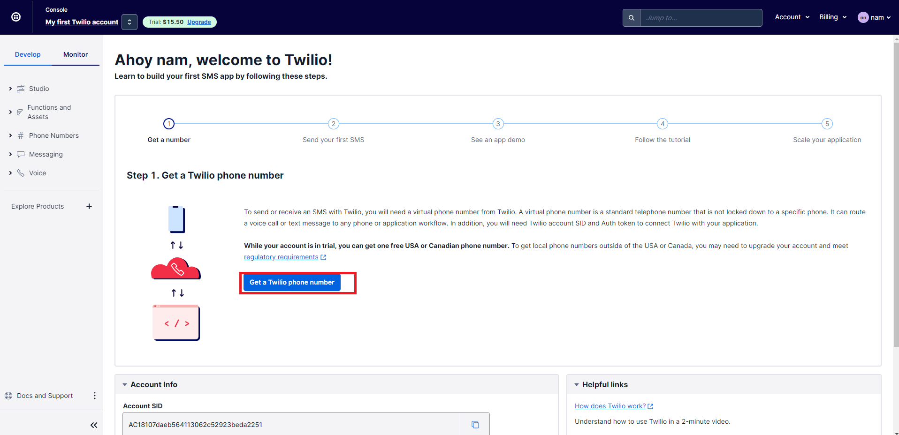
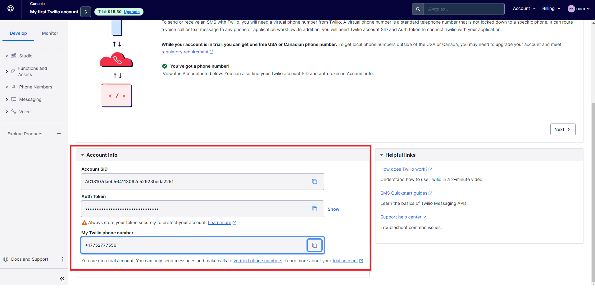

# send SMS via twilio

register new account 

https://www.twilio.com/try-twilio

result

    // CURL
    curl --location --request GET 'http://localhost:8080/sendSMS'

Result: the money was minus, and we can use when out of money

Ref: https://www.youtube.com/watch?v=OuBttmaPlhM&ab_channel=Amigoscode
